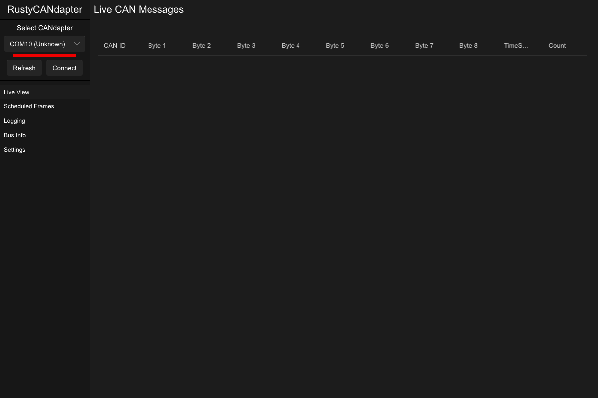

# RustyCANdapter

Build for use the the [FSAE47 Electrical Team](https://www.fsae.co.nz) for use with their CANdapters to allow for better debugging.



## About

The standard CANdapter analyser and logger programs kinda suck so here you go

## Usage

1. Install Rust by following the [Rust Getting Started Guide](https://www.rust-lang.org/learn/get-started).
   Once this is done, you should have the ```rustc``` compiler and the ```cargo``` build system installed in your path.
2. Install [`cargo-generate`](https://github.com/cargo-generate/cargo-generate)
    ```
    cargo install cargo-generate
    ```
3. Set up a sample project with this template
    ```
    cargo generate --git https://github.com/slint-ui/slint-rust-template --name my-project
    cd my-project
    ```
3. Build with cargo
    ```
    cargo build
    ```
4. Run the application binary
     ```
     cargo run
     ```

We recommend using an IDE for development, along with the [LSP-based IDE integration for `.slint` files](https://github.com/slint-ui/slint/blob/master/tools/lsp/README.md). You can also load this project directly in [Visual Studio Code](https://code.visualstudio.com) and install the [Slint extension](https://marketplace.visualstudio.com/items?itemName=Slint.slint).

## Next Steps
